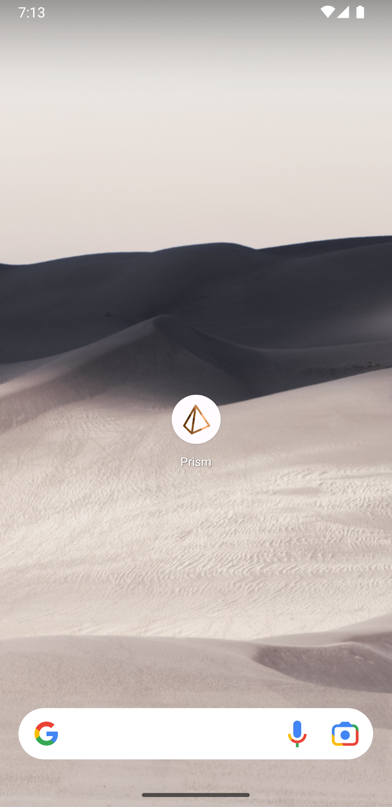
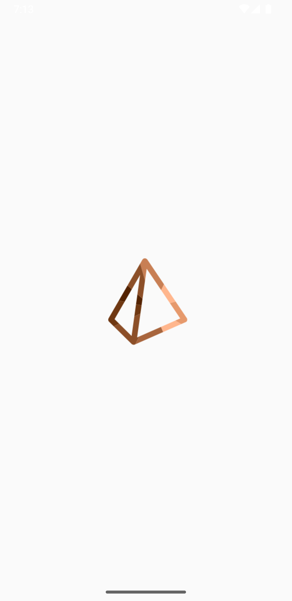
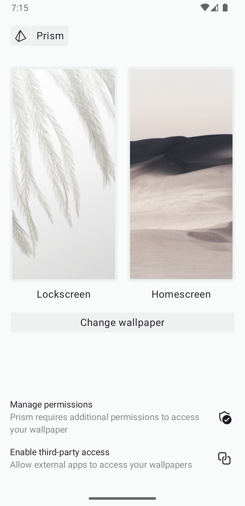

## Prism

A wallpaper manager for API33+ built to allow wallpaper retrieval by allowlisted third-party apps.

<div style="display: flex; flex-direction: row; width: 100%; max-width: 760px;">
    
    
    
</div>

#### 3rd Party Usage

Enable third-party access in the app, then in your own app implement the following contentResolver:

```kotlin
contentResolver.query(
    /* uri = */ Uri.parse("content://io.karn.prism.WallpaperContentProvider/wallpapers"),
    /* projection = */ arrayOf(BaseColumns._ID, "type", "uri"),
    /* selection = */ null,
    /* selectionArgs = */ null,
    /* sortOrder = */ null
)?.use { cursor ->
    try {
        while (cursor.moveToNext()) {
            val id = cursor.getLong(cursor.getColumnIndexOrThrow(BaseColumns._ID))
            val type = cursor.getString(cursor.getColumnIndexOrThrow("type"))
            val uri = cursor.getStringOrNull(cursor.getColumnIndexOrThrow("uri"))

            Log.w("WallpaperContentResolver", "Resolved wallpaper: $id, $type, $uri")
        }
    } catch (e: Exception) {
        Log.e("TAG", "Error loading wallpapers", e)
    }
}
```

#### Limitations

- The contentResolver can be used to subscribe to changes but it is not always accurate due to
variations in OEM implementations of the Settings.Secure.THEME_CUSTOMIZATION_OVERLAY_PACKAGES
setting. Applications can subscribe to the deprecated but still functioning
Intent.ACTION_WALLPAPER_CHANGED broadcasts and combine it with the ContentResolver above.